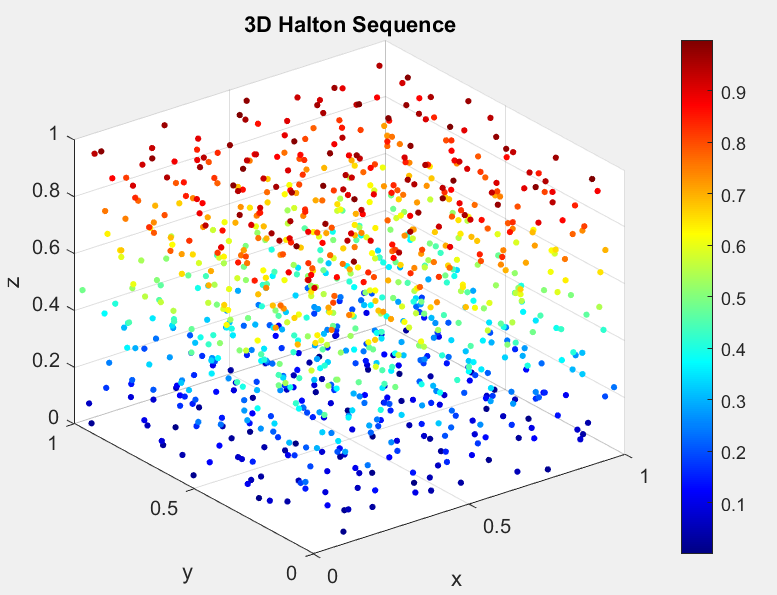

# haltonpoints
A very simple Halton Points generator function.
Halton sequences are quasi-random points that evenly fill the n-dimensional unit cube $[0,1)^{n}$.

Example: 1000 points in $R^{3}$:

May come back and implement a more sophisticated version to better handle higher dimensions (100+) as well as issues caused by using higher primes.
Great introduction to the topic and source of algorithm: https://en.wikipedia.org/wiki/Halton_sequence#
